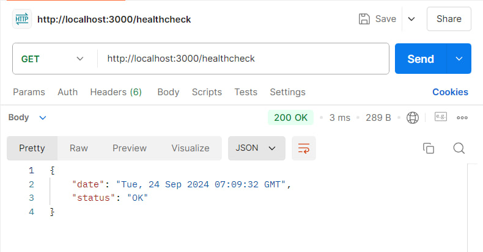

# Back-end-Lab1

Цей проект представляє простий REST API з ендпоінтом `/healthcheck`, який повертає статус сервісу та поточну дату.

## Вимоги

- Node.js
- Docker
- Docker Compose

## Встановлення та запуск

### 1. Клонуйте репозиторій на локальний комп'ютер:

```bash
git clone https://github.com/tytianiuk/Back-end-Lab1
cd Back-end-Lab1
```

### 2. Запуск Docker у корні проєкту:

```bash
docker-compose up --build
```

### 3. Перевірка API:

- За допомогою будь-якого браузера, введіть у пошуковий рядок:

```bash
http://localhost:3000/healthcheck
```

- За допомогою Postman, введіть у пошуковий рядок з методом GET:

```bash
http://localhost:3000/healthcheck
```



### 4. Зупинка Docker:

```bash
docker-compose down
```

## Доступний деплой на сервісі render.com:

*https://back-end-lab1-p2yb.onrender.com/*
